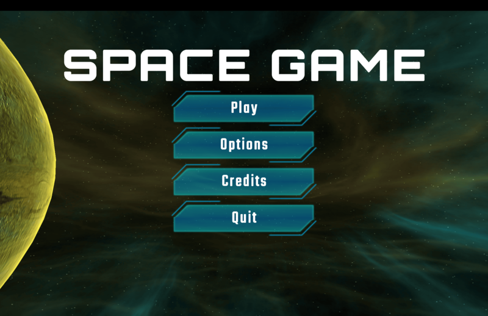
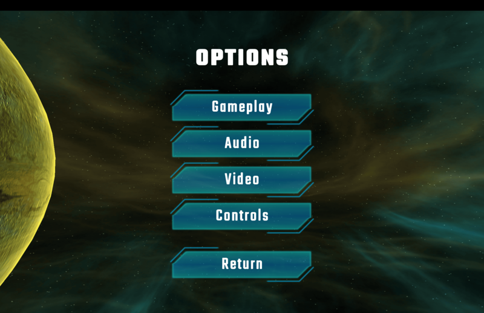
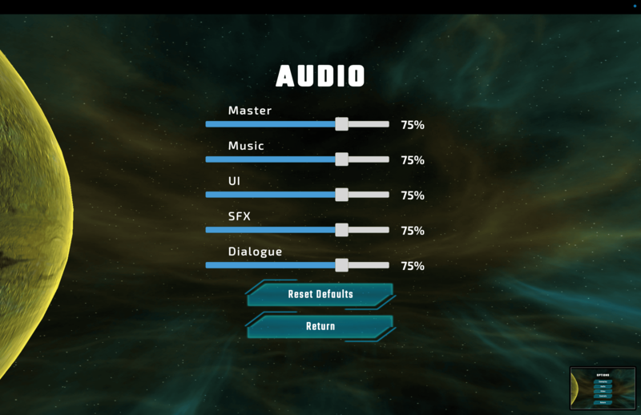
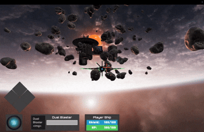
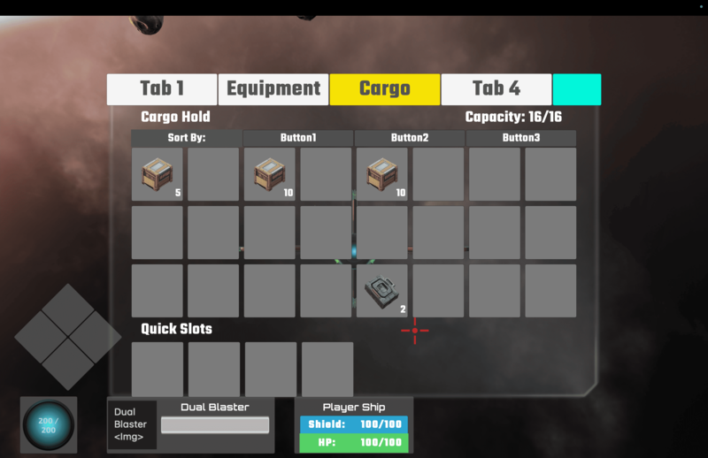
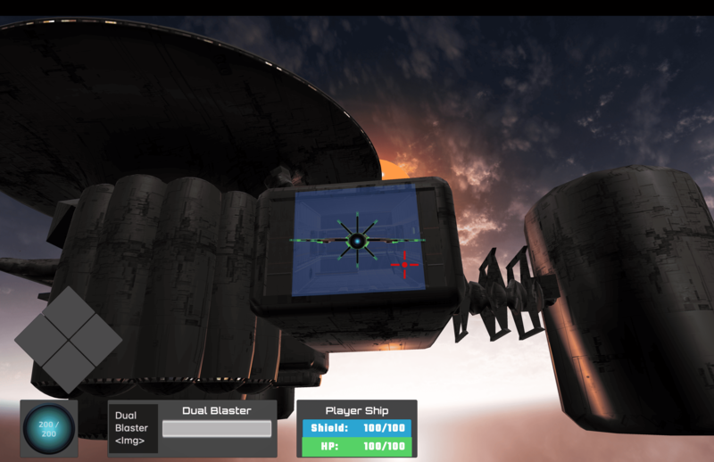
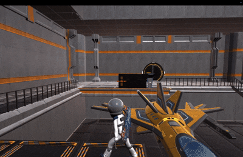

**Platform:** macOS & Windows Demo  
**Engine:** Unity 2022.3 LTS  

## Gameplay 
### Start Scene

  
  
  

### Ship Scene

#### Inventory

### Entrance to switch between Ship and Character -Scene
"

### Character Scene

## Controls
Action          PC      Controller (not tested)

Universal
OpenMenu       ESC

ShipView
SwitchWeapo

CharacterView
SwitchWeapon    Q

SwitchWeapon    Q       
Reload          R
